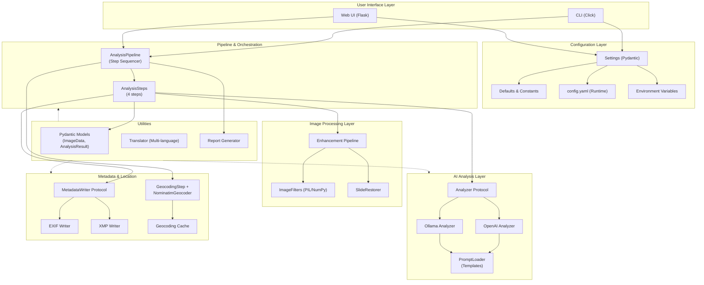

# Architecture Review — Picture Analyzer

*Date: 2026-06-08*

---

## 1. High-Level Component Diagram



---

## 2. Core Components

| Component | Responsibility | Files | Pattern |
|-----------|----------------|-------|---------|
| **CLI Layer** | User interaction, argument parsing, batch orchestration | `cli/app.py` | Click commands with fallback to legacy modules |
| **Settings** | Centralized, type-safe configuration (Pydantic) | `config/settings.py`, `config/defaults.py` | Layered priority: CLI → env vars → config.yaml → defaults |
| **AnalysisPipeline** | Orchestrates analysis steps in sequence | `pipeline/pipeline.py` | Composite pattern; accumulates `AnalysisResult` |
| **Analysis Steps** | Metadata, Location, Enhancement, SlideProfiles | `pipeline/steps.py` | Strategy pattern; each step is independent and resumable |
| **Analyzer Protocol** | Abstract image analysis interface | `core/interfaces.py` | Structural subtyping (duck typing) |
| **OpenAI/Ollama** | LLM analysis implementations | `analyzers/openai.py`, `ollama.py` | Provider pattern |
| **Prompt Loader** | Manages prompt templates with substitution | `data/prompt_loader.py` | Factory pattern; supports localization |
| **Enhancement Pipeline** | Applies AI-recommended image adjustments | `enhancers/pipeline.py` | Filter chain pattern with PIL/NumPy backends |
| **Metadata Writers** | Embeds analysis into image EXIF/XMP | `metadata/exif_writer.py`, `xmp_writer.py` | Protocol-based; extensible for new formats |
| **Geocoding + Cache** | Location name → GPS conversion with caching | `geo/nominatim.py` | Decorator pattern (cache wraps geocoder) |
| **Translator** | Post-processing language translation | `utils/translator.py` | Optional; pure function |
| **Core Models** | Pydantic dataclasses for type safety | `core/models.py` | Frozen/immutable; `model_copy()` for updates |

---

## 3. Strengths

1. **Strong type safety** — Pydantic models throughout eliminate untyped dict passing. `AnalysisResult` is the single source of truth.
2. **Clean dependency injection** — Components receive settings/dependencies; no singletons or global state. Easy to test with mocks.
3. **Plugin architecture via Protocols** — `Analyzer`, `Geocoder`, `MetadataWriter` are structural protocols. New providers can be added without touching core code.
4. **Modular pipeline** — Steps are independent, sequenceable, and resumable. Disabling a step is trivial.
5. **Excellent configuration layer** — Pydantic Settings with layered priority (CLI > env > yaml > defaults). Every hardcoded value moved to `defaults.py`.
6. **Separation of concerns** — Prompt templates live in `data/templates/`, not embedded in code. EXIF/XMP logic isolated from analysis logic. Translation decoupled.
7. **Error resilience** — Pipeline catches timeouts, retries once after 30s. Skips failed steps with clear logging. Non-fatal errors don't abort batch processing.
8. **Proper Python package** — Modern `pyproject.toml` with entry points, optional dependencies (`[web]`, `[yaml]`, `[heic]`), installable via `pip install -e .`
9. **Translation integration** — Multi-language metadata support (nl, de, fr, es, it, pt, ja, zh, ru) without hardcoding translations.

---

## 4. Weaknesses & Recommendations

### 🔴 Critical

**1. No LLM Output Validation**
- LLM responses are parsed into `AnalysisResult` but never validated. Missing/malformed fields default to `None` silently.
- *Fix*: Add `pydantic.TypeAdapter` schema validation for LLM JSON output. Reject non-conforming responses.

**2. Inconsistent Error Handling**
- Pipeline catches broad `Exception`. Metadata writers return `bool` (silent failure). No custom exception hierarchy.
- *Fix*: Define `PictureAnalyzerError` hierarchy (`ValidationError`, `AnalysisError`, `IOError`, `ConfigError`). Catch and re-raise with context.

**3. Legacy Code Bridge**
- CLI still imports old root-level modules (`picture_analyzer_legacy.py`), creating two parallel code paths.
- *Fix*: Fully port legacy code to new package. Delete old files.

**4. Silent Metadata Writer Failures**
- `ExifWriter` silently skips unsupported formats (e.g., PNG). User thinks metadata was written when it wasn't.
- *Fix*: Add format-specific writers (`SidecarWriter` for PNG). Error if no writer for format.

### 🟡 Major

**5. No Checkpoint/Resume for Batch Jobs**
- If a 20-image batch fails on image 15, there is no way to resume. Must start over.
- *Fix*: Write `{image}.checkpoint.json` after each image. On resume, skip already-completed images.

**6. Prompt Templates Lack Versioning**
- Changing a template silently affects all future analyses. No way to track "analyzed with v1.0 prompt".
- *Fix*: Add `_version` header to each template. Track in `AnalysisResult.prompt_version`.

**7. Per-Step Enable/Disable Not Configurable**
- No way to run just the "enhancement" or "slide_profiles" step from config. Must edit code.
- *Fix*: Add `steps.metadata.enabled`, `steps.location.enabled`, etc. to config schema.

**8. Batch Error Reporting Missing**
- No final summary of success/failure counts. Must grep logs.
- *Fix*: Print `✓ 18 succeeded, ⚠ 2 timed out, ✗ 1 failed` at end of batch. Optionally write `errors.csv`.

---

## 4b. Feature Requirements

### 🟢 Step Re-run & Image Regeneration

**Requirement**: It must be possible to re-run one or more specific pipeline steps on already-processed images, update the existing `*_analyzed.json` in place, and optionally regenerate the output images from the updated JSON.

**Use cases**:
- Re-run only `slide_profiles` after improving the prompt, without re-running metadata
- Re-run `metadata` on a subset of images that had blank fields
- After manually editing a JSON, regenerate the enhanced/restored images without re-analyzing

**Architectural implications**:

1. **JSON must be the source of truth for image generation**
   - The enhancement and restoration pipeline must be callable with only a JSON file as input (no re-analysis required).
   - Currently `EnhancementStep` and `SlideRestoreStep` are tightly coupled to the analysis pipeline run. They need to be callable standalone: `picture-analyzer regenerate --from-json image_analyzed.json`.

2. **Steps must be selectively runnable**
   - The pipeline needs a `--steps` flag: `picture-analyzer analyze image.jpg --steps metadata,slide_profiles`
   - Each step reads from the existing JSON (if present) as its `partial` input, runs only the requested steps, then merges results back into the JSON.
   - This is an extension of item #7 (per-step enable/disable).

3. **JSON merge strategy must be well-defined**
   - Re-running a step should update only that step's keys in the JSON, leaving all other keys untouched.
   - Currently the pipeline always starts from a fresh `AnalysisResult`. It needs a `load_partial(json_path)` function that initialises the pipeline state from an existing JSON.

4. **Batch re-run support**
   - `picture-analyzer analyze /folder --steps slide_profiles --batch` should re-run only `slide_profiles` on all images that already have a JSON in the output folder.

**Proposed CLI design**:
```
# Re-run specific steps on a single image, update JSON in place
picture-analyzer analyze image.jpg --steps metadata,slide_profiles --update-existing

# Re-run specific steps on a whole batch
picture-analyzer analyze /folder --batch --steps slide_profiles --update-existing

# Regenerate enhanced/restored images from existing JSON (no LLM call)
picture-analyzer regenerate image_analyzed.json
picture-analyzer regenerate /folder --batch
```

**Implementation approach**:
- `load_partial_from_json(path)` → `AnalysisResult`: deserialise existing JSON into `AnalysisResult`
- `pipeline.run(image, partial=load_partial_from_json(...), steps=[...])`: skip steps not in the list
- `regenerate_images(analysis_result, output_dir)`: standalone function that applies enhancement/restoration from a populated `AnalysisResult`, no LLM needed

### 🟡 Medium

**9. Tight Coupling to External API Clients**
- `OllamaAnalyzer` directly instantiates `ollama.Client(host=...)`. Hard to mock for testing.
- *Fix*: Create thin `OllamaClient` / `OpenAIClient` wrappers in `clients/` package.

**10. No Circuit Breaker for API Failures**
- If the API is down, every image fails. Only one retry after 30s.
- *Fix*: Add exponential backoff. After 3 consecutive failures, pause batch briefly.

**11. `AnalysisResult` is Bloated**
- 20+ optional fields; many never populated. `raw_response` is an untyped catch-all dict.
- *Fix*: Split into `CoreAnalysisResult` + `ExtendedFields`. Remove rarely-used fields from the main model.

**12. Translation Scope (by design)**
- `metadata.*` fields are translated to the target language (Dutch) for human-readable EXIF output.
- `slide_profiles` and enhancement recommendations intentionally stay in English — they are consumed by the enhancement pipeline and translating them would break downstream processing.
- This is a deliberate design boundary: translate for humans, keep English for machines.

---

## 5. Prioritized Action Items

### High Impact

| Priority | Task | Effort |
|----------|------|--------|
| 1 | LLM output schema validation | 2–3 days |
| 2 | Unified exception handling | 2 days |
| 3 | Batch error reporting (CSV) | 1–2 days |
| 4 | Remove legacy code bridge | 3–5 days |

### Medium Impact

| Priority | Task | Effort |
|----------|------|--------|
| 5 | **Step re-run: `--steps` flag + `--update-existing`** | 2–3 days |
| 6 | **Standalone image regeneration from JSON** | 1–2 days |
| 7 | Checkpoint/resume for batches | 1 day (simplified by #5) |
| 8 | Prompt versioning | 1–2 days |
| 9 | Per-step enable/disable in config | 1 day |
| 10 | Format-specific metadata writers | 2–3 days |

### Low Impact

| Priority | Task | Effort |
|----------|------|--------|
| 9 | API client abstraction (testability) | 2–3 days |
| 10 | Circuit breaker for API failures | 2 days |
| 11 | Comprehensive test suite (80%+ coverage) | 5–10 days |

---

## 6. Key Answers

**Is the pipeline modular and extensible?**
Yes — steps are independent and implement a protocol. But pipeline construction is hardcoded in `build_pipeline()`; custom step ordering requires code changes.

**How are prompts managed?**
Well — templates in `data/templates/` as `.txt` files, loaded by `PromptLoader`. No hardcoding. Gap: no versioning, no schema validation of expected output fields.

**How is LLM output validated?**
Weakly — `_parse_json()` extracts JSON and converts to `AnalysisResult`, but missing/wrong-type fields default to `None` silently. No schema enforcement.

**How is configuration handled?**
Very well — Pydantic Settings with layered priority and typed fields. Gap: no URL format validation for `host`, no cross-field constraints.

**How is error handling structured?**
Inconsistently — pipeline catches `Exception` broadly; analyzers catch `JSONDecodeError`; writers return `bool`. No shared exception hierarchy.

**How is translation integrated?**
Well decoupled — optional post-processing via a pure function `translate_analysis_dict()`. Gap: only translates select fields; slide profiles and enhancement names stay in English.
